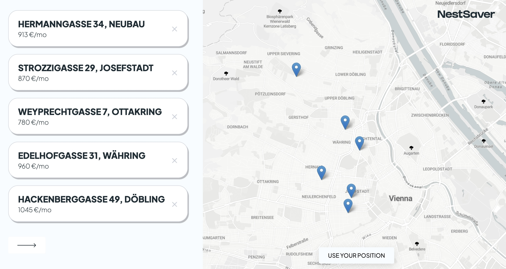

# NestSaver - Making Apartment Search Enjoyable and Memorable

<h1 align="center"><a href='https://nestsaver.netlify.app/' target='_blank' rel='noopener noreferrer'>
nestsaver.netlify.app</a></h1>

# About NestSaver

Welcome to NestSaver, where we believe in making your apartment search an enjoyable and memorable experience. Finding the perfect nest is not just about the place; it's about capturing the moments that turn a space into a home.

Our mission is to provide a seamless and enjoyable experience for individuals looking to find their ideal living space. We understand that a home is more than just a location; it's a collection of memories waiting to happen.

ONavigate and explore apartments effortlessly. Easily review and compare details of apartments you've visited.

# Tech Stack

- React(React Router, Context API, useReducer, useCallback)
- CSS Module
- JSON Server

# Thanks to

<a href="https://leafletjs.com/" target='_blank' rel='noopener noreferrer'>Leaflet

<a href="https://apidocs.geoapify.com/" target='_blank' rel='noopener noreferrer'>Geoapify

<a href="https://www.jawg.io/en/" target='_blank' rel='noopener noreferrer'>JawgMaps

<a href="https://render.com/" target='_blank' rel='noopener noreferrer'>Render

# Live app

Check live app here: 
 <a href='https://nestsaver.netlify.app/' target='_blank' rel='noopener noreferrer'>https://nestsaver.netlify.app/</a>
